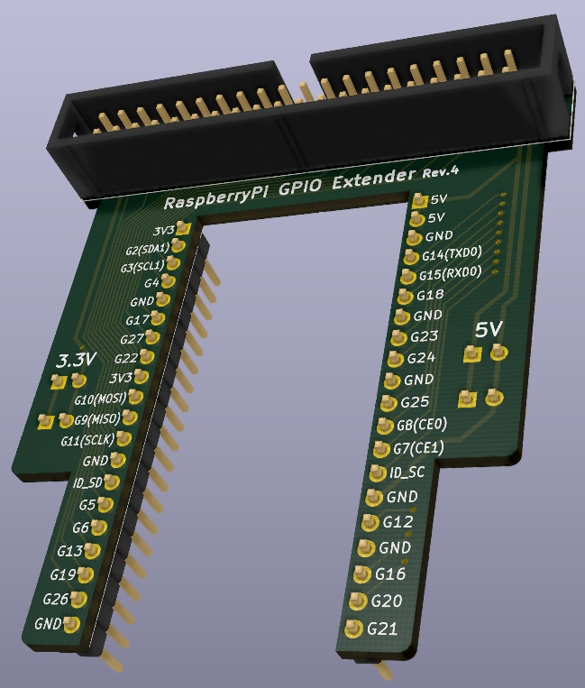
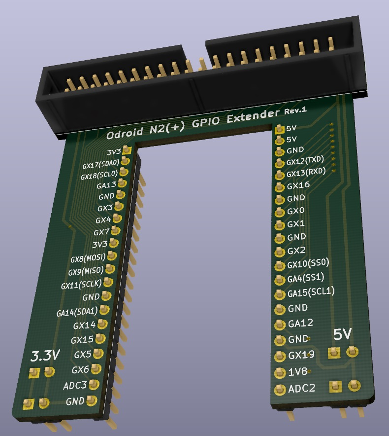

# SBC GPIO 확장 보드

---

[Raspberry Pi용 IO 확장](rasp_gpio_extend/)
([README.md](rasp_gpio_extend/README.md))

---

[Odroid N2(+)용 IO 확장](odroid_gpio_extend/)
([README.md](odroid_gpio_extend/README.md))

---
